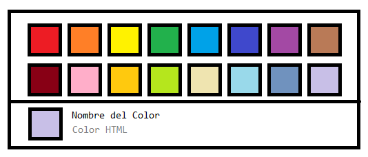
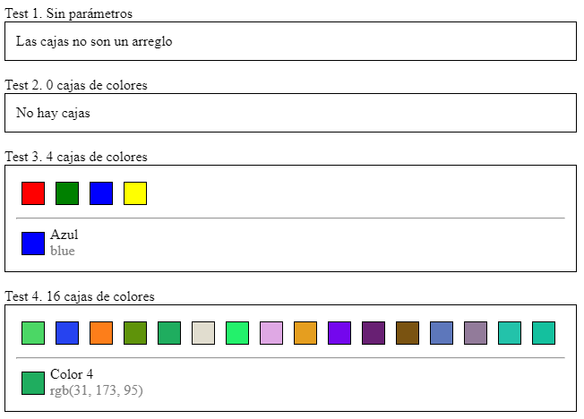

# Mercenarios de Código

Bienvenidos al Proyecto Mercenarios de Código, sientéte libre de explorar.

## Avisos

**Grupo de Whatsapp**

[https://chat.whatsapp.com/HmXsQ72wqtGJ8iibBQajgf](https://chat.whatsapp.com/HmXsQ72wqtGJ8iibBQajgf)

**Nueva mecánica**

Estamos emocionados de anunciarte que hay una mecánica nueva dentro de _Mercenarios de Código_ llamada **Piezas de Código por Compra Inmediata**. La cuál consiste en comprar tus piezas de código que hayas desarrollado por tu cuenta y cumplan los siguientes requisitos:

* Usar Bootstrap con diseño profesional (simétrico y estilizado).
* Contener código limpio y componentes funcionales.
* Poseer pruebas unitarias extensas que demuestren la completa funcionalidad del componente en todos sus casos posibles (usar datos aleatorios y de ser posible ejecuciones automáticas).
* Tener un costo razonable a su complejidad o no indicar ningún precio y esperar la cotización experta que brindamos.
* Estar creada en [codesandbox.io](codesandbox.io).

Si tu pieza cumple los puntos no dudes enviar el link a [kuhnidev@gmail.com](mailto:kuhnidev@gmail.com) con el título `Pieza en Venta`. Recuerda que nuestra `Garantía de uso y protección de datos` nos impide usar tu código completo o parcial si no se te ha pagado o no fue aprobada la pieza, por lo que respetaremos tu código. Además siempre estamos abiertos a ayudarte a mejorar por lo que puedes volver a intentar una y otra vez la venta escuchando nuestros comentarios de mejora.

**Nuevas piezas**

[#108-02](https://github.com/kuhnidev/mercenarios/blob/master/todo/%23108-02--SelectorTallaColor.md)

> No olvides checar el archivo **[vacantes.md](https://github.com/kuhnidev/mercenarios/blob/master/vacantes.md)** ya que ahí colocaremos puestos interesantes que podrías asumir (todos realizados desde casa).

### __Introducción__

El proyecto **Mercenarios de Código** fue desarrollado en el 2019 por **Kuhni Dev** e implementado en enero del 2020. El propósito principal es poder generar cientos de _piezas de código_ a través de cientos de _mercenarios de código_ de tal forma que cada pieza tenga un costo real y cada mercenario pueda monetizar las piezas que construye inmediatamente tras su aprobación y acumular todo el dinero que desee construyendo piezas. Al _mercenario de código_ le llamamos formalmente **Jefe Constructor de Código** o simplemente **constructor**.

Los mercenarios adquieren para nosotros el rango de _Jefe_ debido a que lideran con dominio la construcción de _piezas de código_ en _React_. Y por eso mismo monetizamos las piezas pensando que el trabajo es realizado por un Jefe y no un aprendiz, aunque hemos decidido darle la oportunidad de crecer y volverse un Jefe experto a cualquiera que lo desee sin importar su experiencia previa.

La ventaja de este modelo es evitar la responsabilidad de los programadores frente a las necesidades del mercado en desarrollo de software. Por esto, nosotros **no hacemos firmar ningún contrato, ni responsabilizamos a los mercenarios** de sus creaciones, al contrario, los alentamos a trabajar en lo que se sientan cómodos, cuándo deseen trabajar y cuánto dinero quieran acumular. Así es como pasamos meses creando un nuevo modelo de negocios, del que hoy te puedes beneficiar.

La construcción de piezas de código será tan fácil o difícil según la experiencia que tenga el mercenario programador, sin embargo tenemos criterios sólidos para decidir la complejidad de una _pieza de código_. Es decir, el valor de la pieza estará en función de su complejidad, tanto de diseño, construcción y supervisión. Por lo que los programadores pueden sentirse relajados programando las piezas sin que nadie les diga en cuánto tiempo deberían terminarla.

Finalmente queremos decirte que hemos recorrido bastante el camino de la programación, para saber que harás de este modelo tu nueva forma de vida, por lo que te invitamos a estudiar a fondo la mecánica de construcción de _piezas de código_ para que comiences hoy mismo a ganar dinero.

### __Garantía de uso y protección de datos__

Nosotros **garantizamos no utilizar piezas de código que hayan sido rechazadas o que no hayan sido pagadas** aún en ningún momento, además sólo adquirimos el derecho de uso y distribución de la pieza ya que exigimos usar la licencia MIT en la construcción, pero no haremos ninguna modificación sobre el código entregado, esto garantiza que si el programador desea dejar comentarios de autoría serán respetados, pero nunca aprobaremos piezas que en sus comentarios tengan texto ofensivo o restricciones de uso. Las piezas entregadas deberán contener una licencia MIT de libre uso y haremos reconocimiento al programador de su creación, si este no especifica ninguna autoría tampoco lo haremos nosotros, el código siempre se mantendrá integro en su entrega y nunca almacenaremos códigos no cifrados dentro de nuestros servidores. Tenemos protocolos estrictos de supervisión y sanciones fuertes a quién intente utilizar los códigos rechazados o no pagados, así que no debes pensar en ningún momento que nuestra supervisión de código rechaza a propósito tus entregas.

### __Sobre el repositorio__

En este repositorio encontrarás diversas carpetas que contienen archivos que describen piezas de código.

En la carpeta _**todo**_ contiene las piezas de código disponibles para su construcción, en _**doing**_ están las piezas que han sido asignadas y en _**done**_ se encuentran las piezas que ya han sido construidas.

Cada _pieza de código_ está descrita por los siguientes elementos:

* __Diseño__ - Un boceto aproximado del diseño final al que se desea llegar, es sólo conceptual para guiar a modo de sugerencia al programador, pero no estricto.
* __Funcionalidades__ - Una lista con las funcionalidades que debe cubrir el componente para poder ser validado y monetizado.
* __Protocolo__ -  El _protocolo de datos_ establece cómo será la entrada de datos a la pieza y cuáles deberían ser sus salidas. En el caso de piezas estándar, está será descrita mediante las propiedades que recibe el componente de react, es decir, los atributos de contrucción del componente.
* __Pruebas unitarias__ - Una lista con las pruebas unitarias que serán ejecutadas sobre el componente, para que el _constructor_ pueda determinar los casos y pasar una supervisión limpia.

* __Complejidad__ - La complejidad de la pieza estará desglosada en diseño, funcionalidades, uso de hooks y las pruebas unitarias, arrojando un puntaje total que simbolizará la complejidad de pieza en una escala fija.

* __Valor de la pieza__ - El valor en dinero de la pieza de código tomando en cuenta la complejidad y el monto mínimo para el bienestar en la calidad de vida de los programadores.

Finalmente debes saber que no sólo pagamos dinero por la pieza de código, sino que hay bonos de recompensa que aumentan el valor de la pieza si generaste la documentación extra a la _pieza de código_, como por ejemplo:

* __Código Experto__ - Uso de buenas prácticas y código limpio.
* __Video de Validación__ - Video lo más corto posible en Youtube mostrando que se cumplen las funcionalidades de la pieza.

## Mecánica

El programa de _mercenarios de código_ es para programadores con conocimientos esenciales de React. Este sigue el protocolo que se describe a continuación y se debe prestar atención a los detalles.

### __1. Enviar solicitud de piezas seleccionadas__

Para poder participar en el programa de mercenarios de códigos bastará con seleccionar las piezas que te interesa programar a [kuhnidev@gmail.com](mailto:kuhnidev@gmail.com) con el título exacto `Mercenario de Código - Solicitud`. 

El cuerpo del correo debe contener tu nombre clave de la forma `@alias` dónde el alias es con el que se te reconozca, por cuestiones de repetición de alias nosotros te nombraremos `@alias#1234` dónde `#1234` serán números aleatorios para diferenciarte de otro alias que sean iguales al tuyo, aunque no haya otro igual. Si usas un alias demasiado largo (más de 16 caracteres) te nombraremos `@constructor#1234`. A parte del alias deberás colocar los códigos de cada pieza desees programar, cada código tiene la estructura de `#200108-01`. Finalmente deberás dejar tu usuario de [Paypal Me](https://www.paypal.me), [CodeSanbox](https://codesandbox.io) y de [Github](https://github.com), si no tienes créalos, son gratuitos. El primero será para poder pagarte directamente a tu link personalizado de paypal. El segundo será el usuario dónde podrás armar tu portafolio con las _piezas de código_ que has programado y el tercero será para poder acceder a la documentación de las piezas de código que hayas generado en bonos.

> Ejemplo de un correo de solicitud

```text
mail
    from: badillo.soft@hotmail.com
    to: kuhnidev@gmail.com
subject
    Mercenario de Código - Solicitud
content
    @badillosoft

    #108-01
    #109-12
    #110-03
    #117-04

    Codesandbox: https://codesandbox.io/u/badillosoft
    Github: https://github.com/badillosoft
    Paypal: https://www.paypal.me/badillosoft
```

Para enviar las piezas que te gustaría programar toma en cuenta lo siguiente:

1. **La piezas se te asignarán mediante un algoritmo inteligente**. El algoritmo tomará en cuenta tus métricas de rendimiento (si has generado) y un balance para que todos los mercenarios tengan la oportunidad de construir piezas.
2. **Tendrás un periodo de tiempo para construir las piezas**, por cada 3 piezas se te dará un día para la entrega, es decir máximo al día siguiente, por lo que si no entregas en esa fecha se te notificará y se volverán a sortear esas piezas a cualquier constructor incluyendote a ti. Esto es importante porque no deberías seleccionar más piezas de las que estes dispuesto a trabajar los días siguientes, tus métricas de rendimiento podrían empeorar debido a que no entregas la construcción a tiempo, pero sobre todo, porque bloqueas piezas que otros constructores querrían realizar. Lo recomendable es que elijas entre 3 y máximo 6 piezas para que los próximos 2 días las realices y ganes tu dinero por las piezas realizadas. El tiempo de entrega no depende de la complejidad de las piezas, sino que determina que deberías ser capaz de construir 3 piezas por día sin importar su complejidad, por lo que si no te sientes cómodo a ese ritmo te sugerimos ir por las piezas menos complejas para trabajar tranquilo todo el día. También debes saber que nos esforzamos continuamente para que haya piezas siempre suficientes para todos los programadores que deseen construirlas.
3. **Las piezas no serán pagadas hasta su revisión positiva**, toma esto en cuenta, ya que si documentas bien tu pieza y entregas tu vídeo ganando bonos y con un código experto, tu revisión será bastante rápida y ese mismo día podrías obtener el dinero por la construcción. De lo contrario quizás tengas que esperar a una revisión más lenta que podría tardar incluso varios días. Si la revisión tarda demasiado tu pieza incrementará su valor mediante un bono especial de revisión lenta, por lo que tu no te preocupes, tarde o temprano caerá tu dinero.
4. **No entregues piezas mal construidas**, que no cumplan alguna funcionalidad especificada o que tenga código demasiado malo. Nosotros confiamos que serás lo suficientemente profesional (por eso te consideramos **Jefe Constructor** y no simplemente un Aprendiz de Programación). Por lo que somos estrictos en nuestro control de supervisión, ya que es un proceso muy difícil, entonces si detectamos anomalías las reportaremos inmediatamente sin oportunidad de revocación, esto quiere decir que habrás fallado la construcción y tendrás que empezar el proceso de nuevo quizás con una nueva pieza si el algorimo lo determina. Puedes pedir supervisión de tu pieza manualmente antes de entregar tu pieza, tomando en cuenta que se te descontará un porcentaje del 10% cada que lo solicites. Estamos seguros que van a asumir el reto de aprender sólo por internet (ya que es nuestra filosofía que sean mercenarios fuertes e independientes) y los invitamos a unirse ustedes mismos en comunidad mediante este [github](https://github.com/kuhnidev/mercenarios/issues) o crear algún hilo en [stackoverflow](https://stackoverflow.com) o a través de [slack](https://slack.com).

Una vez que envies el correo espera el correo de respuesta dónde vendrán las piezas que te fueron asignadas, el valor desglosado y total, las fechas límite de entrega y algunos tips extra que iremos mejorando con el tiempo.

> Ejemplo de un correo de asignación

```text
mail
    from: kuhnidev@gmail.com
    to: badillo.soft@hotmail.com
subject
    Mercenario de Código - Solicitud
content
    Gracias por ser parte de los Mercenarios de Código, a continuación te diremos que piezas te han sido asignadas y su fecha límite de entrega. Ten cuidado de las advertencias sobre la construcción y entrega de las piezas de código que puedes consultar en https://github.com/kuhnidev/mercenarios.

    En hora buena y que sea una buena construcción.

    @badillosoft#1276

    Piezas asignadas:
    #108-01 [ASIGNADA]   --> $124 MNX
    #110-03 [ASIGNADA]   --> $380 MNX
    #117-04 [ASIGNADA]   --> $720 MNX

    Total: $1,224 MNX + BONOS

    Piezas reachadas:
    #109-12 [RECHAZADA]  --> #R18

    Fechas máximas de entrega:
    #108-01 --> 2020/01/10
    #110-03 --> 2020/01/10
    #117-04 --> 2020/01/10

    Recuerda terminar a tiempo para que tu rendimiento en construcción no se vea afectado.

    Te recordamos que el proceso es utilizar https://codesandbox.io como editor de texto, o en su defecto https://github.com si deseas trabajar en local sobre tu propio editor de código.
    
    Al terminar de construir tu código deberás enviarnos el link con la pieza de código funcionando sobre https://codesandbox.io o si lo deseas puedes enviar el link de https://github.com dónde está el código de tu pieza, tomando en cuenta que en el último se te descontará un porcentaje del valor de la pieza por costos de migración de código y complejidad en pruebas unitarias.

    Te recordamos que si todo sale bien transferiremos la cantidad de $1,224 MNX + BONOS al siguiente link de Paypal:
    
    Paypal: https://www.paypal.me/badillosoft/1224

    Asombroso verdad, hora de construir. 
    
    Buena suerte :D

    Tus amigos de Kuhni Dev
```

### __2. Construir la pieza de código__

Para construir la pieza de código debes leer atentamente las indicaciones de construcción, recuerda que somos estrictos con las piezas mal construidas.

Lo primero es comprender el diseño de lo que se requiere y guiarse con las funcionalidades que describen el diseño y la lógica en un lenguaje más natural. Luego entender cuáles serán las entradas y salidas de datos al componente y pensar si va a requerir o no usar estado interno, contexto, etc. Serás libre de construir cómo desees la pieza de código, sin embargo, salirse demasiado del diseño podría provocar que se rechace la entrega y pierdas todo el esfuerzo invertido en la construcción. También considera usar código limpio siempre para obtener bonos extra al precio de la pieza, si el código es muy feo también se podría rechazar la pieza o penalizar.

Las piezas de código deben ser programadas siempre  como **Componentes Funcionales** ya que hace más fácil su ensamble y supervisión, si deseas utilizas **Componentes Clase** deberás aceptar la penalización por hacerlo ya que tendremos que esforzarnos por construir componentes superiores que engrapen tu componente clase sobre un componente funcional, si deseas aún así correr el riesgo puedes usarlos.

Generalmente hay tres tipos de piezas de código que necesitamos:

* __Funciones__ - Muchas veces requerimos sólo funciones que resuelvan un problema específico, estás generalmente las usamos cuándo la lógica no depende de un diseño.
* __Hooks__ - Para los programadores más avanzados pagamos muy bien la creación de _hooks_ para el diseño lógico del componente, te recomendamos practicar y estudiar ya que luego podría volverse un estándar.
* __Componentes__ - En la construcción generalmente usamos _componentes funcionales_ y _hooks_ para retener el estado, acceder al contexto, crear _reducciones lógicas de acciones_, usar _memorización_, etc.

Si tu logras siempre dividir tu código en esos tres tipos de arquitecturas, serás reconocido por nosotros y nos aseguraremos que tus bonos siempre sean altos. Así que aquí dejámos un ejemplo para animarte.

> Ejemplo de una **pieza de código**

**Diseño**



**Funcionalidades**

* Se muestra una malla con cajas de colores
* Las cajas serán alineadas usando flexbox aunque en el diseño se muestren 16 podrían ser más o menos
* El ancho y alto de las cajas será igual y fijo recibido como parámetro de entrada o supuesto `24px`.
* Las cajas y colores serán recibidos como una lista de objetos _json_ en los parámetros de entrada como se describe en el protocolo de entrada.
* Al seleccionar una caja en la caja de la parte inferior se debe mostrar el mismo color y se deberá sustituir el label de `Nombre del Color` por el nombre de la caja en la clave `name` del objeto _json_ y `Color HTML` por el color html especifícado en la clave `color` del objeto _json_ que describe la caja.
* En el parámetro de salida `onColorChange` se debe enviar el _json_ de la caja como primer parámetro y el color hexadecimal como segundo parámetro.
* Se debe considerear que los parámetros de entrada o salida podrían no ser definidos y se deberá manejar la lógica para no causar error colocando algún valor por defecto o alguna condición que pregunte si está definido el parámetro.

**Código**

https://codesandbox.io/s/colorselector108-01-mp9zz

**Resultado**



### __3. Entregar la pieza de código__

Una vez que hayas construido la pieza y hayas verificado que todas las funcionalidades se cumplan correctamente, podrás enviar un correo de nuevo a [kuhnidev@gmail.com](mailto:kuhnidev@gmail.com) con los links para su revisión. Ten en cuenta que como tú hay otros mercenarios esperando revisión, por lo que se te notificará con un correo cuándo empiece la revisión de tu pieza por si quieres unirte al hangouts en vivo y escuchar los comentarios de tu revisión u opinar algo al respecto. Las decisiones del supervisor no pueden ser apeladas y este sólo considerará corregir la pieza si la corrección es mínima, pero tendrá la libertad de avisarte que penalización será efectuada. Si el ambiente se vuelve hostil o agresivo el supervisor cerrará el hangouts sin aviso previo y no se podrá seguir el proceso de supervisión. El supervisor no hará caso de las explicaciones que intente dar el constructor y se limitará a explicar lo que va supervisando. Si el supervisor solicita información del constructor para agilizar la supervisión lo solicitará en ese momento y podrá determinar si seguir la supervisión con o sin el constructor, con o sin el hangouts.

Para el correo de entrega bastará enviar el como sujeto el texto `Mercenarios de Código - Entrega #108-01` dónde `#108-01` es el código de la pieza asignada. No se podrá enviar el correo desde un correo diferente del que se hizo la solicitud y tampoco se podrá hacer la entrega de más de una pieza en el mismo correo.

> Ejemplo de un correo de entrega

```text
mail
    from: badillo.soft@hotmail.com
    to: kuhnidev@gmail.com
subject
    Mercenario de Código - Entrega #108-01
content
    Codesandbox: https://codesandbox.io/s/colorselector108-01-mp9zz
```

En este caso se dejó el link de *CodeSandbox*, si se deja un link a *Github* se tomará como enterado sobre la penalización por migración de código.

El pago se hará inmediatamente una vez aprobada la pieza y se entregará un reporte sobre los puntos de supervisión.

Si el mercenario además quiere el bono por video de Youtube explicando las funcionalidades en video, entonces deberá colocar el link de youtube anteponiendo `Youtube: https://...`.

## Comentarios Finales

Bueno, ya tienes todo lo necesario para comenzar a construir piezas, entonces vé y selecciona alguna pieza de la carpeta `todo` y envíanos un correo.

Recuerda que las piezas en otras carpetas no serán asignadas ni recibidas y todos los correos mal estructurados serán ignorados. Cada correo recibido será contestado, por lo que no puedes suponer que recibimos tu solicitud.

> No construyas piezas hasta que nosotros autoricemos su construcción.

Recuerda que sólo las piezas aprobadas serán pagadas por el valor indicado en el correo de asignación sólo si cumple la supervisión satisfactoria. Las piezas rechazadas no serán pagadas y se enviará un correo explicando los motivos. Las piezas rechazadas podrían no volver a ser asignadas al mismo constructor, por lo que debes considerarla como una construcción fallida.

Tus entregas serán monitoreadas y llevaremos métricas anónimas sólo para poder asignarte más piezas la próxima vez. Si tu deseas que no midamos el rendimiento al asignar la pieza puedes colocar el texto `SIN RENDIMIENTO`, entonces la asignación será suponiendo que eres un mercenario nuevo. El rendimiento siempre es a favor y nunca en contra, es decir, los mercenarios nuevos siempre comienzan con rendimiento 0. El rendimiento es para que puedas si lo deseas solicitar más piezas y si tu rendimiento es alto no tendremos problemas en asignarte hasta 15 o más piezas para trabajarlas una semana entera. Esto también nos conviene porque ciertas piezas podrían ser dependientes de otras. Cuándo la dependencia es alta nuestros expertos determinarán si enviarte a enlaces a otras piezas de código ya construidas para que las uses de base, sólo cuándo se requiera darle continuidad a otras piezas.

Bueno, eso es todo por ahora, mantente al día mediante las actualizaciones que hagamos a este repositorio. No hay canales oficiales momentáneamente, pero seguramente estaremos presentes pronto en todas las redes sociales mediante el hashtag `#MercenariosDeCodigo`.

Ahora a construir :D

Gracias por llegar al final.

Tus amigos de Simbionte

Alan Badillo (@badillosoft)
abadillo@simbionte.mx

Juan Villa (@jvilla)
jvilla@simbionte.mx

Kuhni Dev Team &copy; 2019