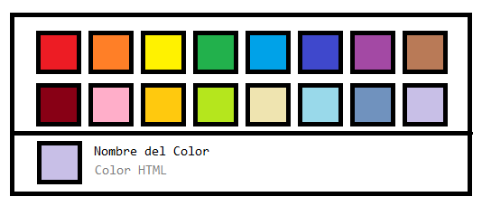

# `#108-01` ColorSelector 

8 de enero de 2020 (**$68 MXN**)

## Diseño



## Funcionalidades

* Se muestra una malla con cajas de colores
* Las cajas serán alineadas usando flexbox aunque en el diseño se muestren 16 podrían ser más o menos
* El ancho y alto de las cajas será igual y fijo recibido como parámetro de entrada o supuesto `24px` .
* Las cajas y colores serán recibidos como una lista de objetos _json_ en los parámetros de entrada como se describe en el protocolo de entrada.
* Al seleccionar una caja en la caja de la parte inferior se debe mostrar el mismo color y se deberá sustituir el label de `Nombre del Color` por el nombre de la caja en la clave `name` del objeto _json_ y `Color HTML` por el color html especifícado en la clave `color` del objeto _json_ que describe la caja.
* En el parámetro de salida `onColorChange` se debe enviar el _json_ de la caja como primer parámetro y el color hexadecimal como segundo parámetro.
* Se debe considerear que los parámetros de entrada o salida podrían no ser definidos y se deberá manejar la lógica para no causar error colocando algún valor por defecto o alguna condición que pregunte si está definido el parámetro.

## Protocolo

__Estructuras de datos__

`ColorBox` - Representa un objeto _json_ con la estructura:

``` json
{
    "name": "Rojo",
    "color": "#FF0000"
}
```

Los colores son cuales quiera colores `CSS/HTML` como hexadecimales, nombrados o descritos: `#00FF00`, `green`, `rgba(0, 255, 0, 1)`, etc.

__Entrada__

`boxes [Opcional]` - Representa un arreglo de objetos `ColorBox` los cuáles contienen la información de la caja de color.

``` json
[
    {
        "name": "Rojo",
        "color": "#FF0000"
    },
    {
        "name": "Azúl",
        "color": "rgb(0, 0, 255)"
    },
    ...
]
```

__Salida__

`onColorChange (box, color) [Opcional]` - Representa una función que se llama cuándo el usuario selecciona una caja cambiando el color, el primer parámetro será el objeto idéntico de la caja (el `ColorBox` asociado del arreglo `boxes` de la entrada) y el segundo parámetro será el color seleccionado (el _string_ de la propiedad `ColorBox.color`).

## Pruebas Unitarias

* __Test 1__ - Probar el componente sin parámetros de entrada
* __Test 2__ - Probar el componente con `boxes` arreglo vacío
* __Test 3__ - Probar el componente con 4 colores
* __Test 4__ - Probar el componente con 16 colores
* __Test 5__ - Probar el componente con 128 colores
* __Test 6__ - Probar el componente con 4 colores y mostrar una alerta con los datos de la caja (nombre y color) cada que cambie.

## Complejidad

### __Diseño__ (12/6)

| Descripción | Indicador | Valoración |
| --- | :-: | :-: |
| Profundidad máxima | 3 | 1 |
| Maquetación dinámica | &#x2713; | 4 |
| Responsivo | &#x2713; | 4 |
| Controles personalizados | &#x2715; | 1 |
| Efectos animados | &#x2715; | 1 |
| Ajustes de región  | &#x2715; | 1 |

### __Funcionalidad__ (6/6)

| Descripción | Indicador | Valoración |
| --- | :-: | :-: |
| Fórmulas matemáticas | &#x2715; | 1 |
| Validaciones de estado | &#x2715; | 1 |
| Almacenamiento local | &#x2715; | 1 |
| Temporizadores | &#x2715; | 1 |
| Sincronización | &#x2715; | 1 |
| APIs externas | &#x2715; | 1 |

### __Construcción__ (7/6)

| Descripción | Indicador | Valoración |
| --- | :-: | :-: |
| Estado | &#x2713; | 2 |
| Efectos | &#x2715; | 1 |
| Reductores | &#x2715; | 1 |
| Contexto | &#x2715; | 1 |
| Hooks personalizados | &#x2715; | 1 |
| Memorización | &#x2715; | 1 |

### __Pruebas unitarias__ (5/4)

| Descripción | Indicador | Valoración |
| --- | :-: | :-: |
| Generación de datos aleatorios | &#x2713; | 2 |
| Uso de componentes externos | &#x2715; | 1 |
| Creación de contexto de pruebas | &#x2715; | 1 |
| Creación de secuencia de pruebas | &#x2715; | 1 |

## Valor

> Complejidad total: **1.3541**

> Precio por complejidad: **$50 MNX**

> Valor total: **$68 MXN**

## Código

AES 256 bit (Código de pieza + Código de programador)

```base64
mR0//+JgTfCBsgyzCaNtTmPnJ+n71SUO8jzofQWzjDvtgz/HQ8wsh5/QtdychfxZ6WkNu8bGTC38Rcu94aYgCw==
```

## Video

_No disponible_

