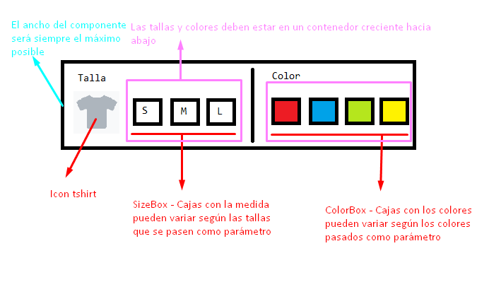

# `#108-02` SelectorTallaColor 

8 de enero de 2020 (**$109 MXN**)

## Piezas relacionadas

Se asumirá que se revisó la pieza y cumple las funcionalidades relacionadas.

`#108-01 ColorSelector` https://codesandbox.io/s/colorselector108-01-mp9zz

## Diseño



## Funcionalidades

* Se muestran dos paneles para configurar tallas y modelos respectivamente.
* En el panel izquierdo se muestra el icono [tshirt](https://fontawesome.com/icons/tshirt?style=solid) de fontawesome y la malla variable de tamaños de tallas.
* Cada talla en la malla será visualizado como una o varias letras que representen la talla dentro de un cuadro con borde.
* La información relacionada a la talla será un objeto con la estructura `TallaBox` que contendrá los datos de la talla, como las siglas y demás información.
* La malla de tallas (el contenedor de las cajas de tallas) debe ser flexible para soportar muchas tallas responsivamente.
* Cuándo se seleccione una talla se debe cambiar el color de borde o de fondo según considere el programador.
* En la etiqueta del texto `Talla` arriba debería modificarse por el nombre de la talla seleccionada como `Talla seleccionada *Chica (S)*` dónde los `*...*` es texto en negritas u otro color.
* Lo mismo se debe aplicar al seleccionar un color, pasar del texto `Color` a `Color seleccionado *Roja*` .
* Cada que se cambie un color o talla se debe mandar a llamar al método `onTallaColorChange(tallaBox, colorBox, talla, color)` con los parámetros descritos en el protocolo de salida.
* Mostrar `Sin tallas` en lugar de la malla de tallas si no se recibe la entrada `tallas`, si no es arreglo o si está vacío.
* Mostrar `Sin Colores` en lugar de la malla de colores si no se recibe la entrada `colores`, si no es arreglo o si está vacío.

## Protocolo

__Estructuras de datos__

`ColorBox` - Representa un objeto _json_ con la estructura:

``` json
{
    "name": "Roja",
    "color": "#FF0000"
}
```

`TallaBox` - Representa un objeto _json_ con la estructura:

``` json
{
    "name": "Chica",
    "sign": "S",
}
```

Los colores son cuales quiera colores `CSS/HTML` como hexadecimales, nombrados o descritos: `#00FF00` , `green` , `rgba(0, 255, 0, 1)` , etc.

__Entrada__

`tallas [Opcional]` - Representa un arreglo de objetos `TallaBox` los cuáles contienen la información de la caja de talla.

``` json
[
    {
        "name": "Chica",
        "sign": "S",
    },
    {
        "name": "Mediana",
        "sign": "M",
    },
    {
        "name": "Grande",
        "sign": "L",
    },
    {
        "name": "Extra Grande",
        "sign": "XL",
    },
    ...
]
```

`colores [Opcional]` - Representa un arreglo de objetos `ColorBox` los cuáles contienen la información de la caja de color.

``` json
[
    {
        "name": "Rojo",
        "color": "#FF0000"
    },
    {
        "name": "Azúl",
        "color": "rgb(0, 0, 255)"
    },
    ...
]
```

__Salida__

`onTallaColorChange (tallaBox, colorBox, talla, color) [Opcional]` - Representa una función que se llama cuándo el usuario selecciona una caja cambiando la talla o cambiando el color, el primer parámetro será el objeto idéntico de la caja de talla (el `TallaBox` asociado al arreglo `tallas`), el segundo parámetro será la caja asociada al color (el `ColorBox`), el tercer parámetro serán las siglas de la talla (el _string_ de la propiedad `TallaBox.sign`) y como cuarto parámetro será el color seleccionado (el _string_ de la propiedad `ColorBox.color` ).

## Pruebas Unitarias

* __Test 1__ - Probar el componente sin parámetros de entrada
* __Test 2__ - Probar el componente con `tallas` arreglo vacío
* __Test 3__ - Probar el componente con `colores` arreglo vacío
* __Test 4__ - Probar el componente con `tallas` y `colores` arreglos vacío
* __Test 5__ - Probar el componente con 3 tallas y 4 colores diferentes.
* __Test 6__ - Probar el componente con 6 tallas y 8 colores diferentes.
* __Test 6__ - Probar el componente con 6 tallas y 128 colores diferentes aleatorios.
* __Test 7__ - Probar el componente con tallas y colores diferentes y mostrar una alerta con los datos de las cajas (nombre de talla y color) cada que cambie.

## Complejidad

### __Diseño__ (12/6)

| Descripción | Indicador | Valoración |
| --- | :-: | :-: |
| Profundidad máxima | 4 | 1 |
| Maquetación dinámica | &#x2713; | 4 |
| Responsivo | &#x2713; | 4 |
| Controles personalizados | &#x2715; | 1 |
| Efectos animados | &#x2715; | 1 |
| Ajustes de región  | &#x2715; | 1 |

### __Funcionalidad__ (6/6)

| Descripción | Indicador | Valoración |
| --- | :-: | :-: |
| Fórmulas matemáticas | &#x2715; | 1 |
| Validaciones de estado | &#x2713; | 1 |
| Almacenamiento local | &#x2715; | 1 |
| Temporizadores | &#x2715; | 1 |
| Sincronización | &#x2715; | 1 |
| APIs externas | &#x2715; | 1 |

### __Construcción__ (7/6)

| Descripción | Indicador | Valoración |
| --- | :-: | :-: |
| Estado | &#x2713; | 2 |
| Efectos | &#x2715; | 1 |
| Reductores | &#x2715; | 1 |
| Contexto | &#x2715; | 1 |
| Hooks personalizados | &#x2715; | 1 |
| Memorización | &#x2715; | 1 |

### __Pruebas unitarias__ (5/4)

| Descripción | Indicador | Valoración |
| --- | :-: | :-: |
| Generación de datos aleatorios | &#x2713; | 2 |
| Uso de componentes externos | &#x2715; | 1 |
| Creación de contexto de pruebas | &#x2715; | 1 |
| Creación de secuencia de pruebas | &#x2715; | 1 |

## Valor

> Complejidad total: **1.3541**

> Precio por complejidad: **$80 MNX**

> Valor total: **$109 MXN**

## Código

AES 256 bit (Código de pieza + Código de programador)

_No disponible_

## Video

_No disponible_