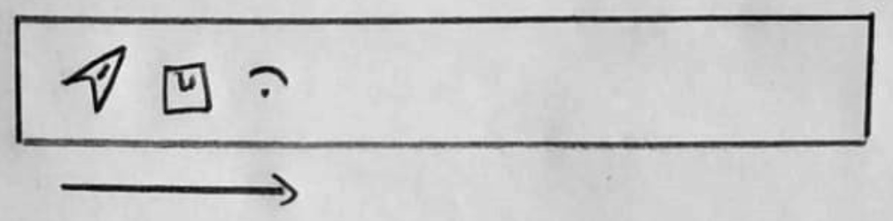
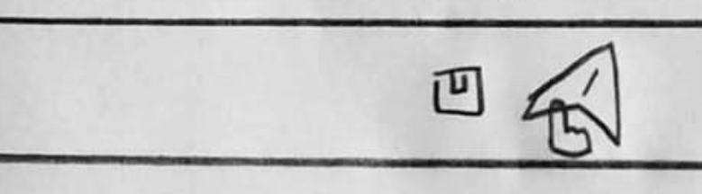

# `#113-01` Toolbar

13 de enero de 2020 (**$82 MXN**)

## Piezas relacionadas

Puede usar las siguientes piezas de referencia para guiar el diseño.

[#108-01 ColorSelector](../all/%23108-01--ColorSelector.md) https://codesandbox.io/s/colorselector108-01-mp9zz

## Diseño

* Se trata de una barra de íconos seleccionables por el usuario.


* La barra puede mostrar los íconos de izquierda a derecha o de derecha a izquierda según se requiera.



* Al pasar el cursor sobre el ícono o al estar activo el ícono, este debe crecer un porcentaje definido.



* Si los íconos superan el ancho, se deben cortar hacia abajo (_wrap_). Se recomienda ver [#108-01 ColorSelector](../all/%23108-01--ColorSelector.md).


## Funcionalidades

* Se muestran una caja contenedora de íconos, los cuáles están alineados a la derecha o izquierda según la propiedad de entrada `align` cuyo valor puede ser un _string_ con `right` (por defecto) o `left`. _**Hint**: Se recomienda usar una caja flexbox en modo fila con wrap habilitado, las clases de diseño de bootstrap son `d-flex flex-row-reverse flex-wrap justify-content-end align-items-center`_.
* Usar los íconos de [fontawesome](https://fontawesome.com/icons?d=gallery&q=question). Ver [#108-01 ColorSelector](../all/%23108-01--ColorSelector.md).
* Al pasar el cursor o si el ícono es el seleccionado este deberá crecer según el porcentaje establecido en la propiedad `sizeGrow` la cuál aumenta tantas veces a la propiedad `size` recibida. _**Hint** - Usa el estilo `font-size` de css para cambiar el tamaño del ícono deseado, considera poner una caja que mantenga el tamaño alto (con sizeGrow) para evitar desbordamiento cuándo crezcan los íconos_.
* Al pulsar sobre un ícono se deberá llamar al método de salida `onIconSelected(iconData, index)`, dónde `iconData` es el objeto que describe al ícono descrito en el protocolo de entrada. También se deberá marcar a ese ícono como el seleccionado del estado.
* Al volver a pulsar un ícono se debe remover el ícono seleccionado del estado y llamar al método de salida `onIconDeselected(iconData)`. _**Hint** - Usa la condición `icon === iconSelected` para determinar si el ícono pulsado es el que ya estaba seleccionado_.
* Si el tamaño de `sizeGrow` es mayor a `1` dejarlo en `1`.
* Usar la clase de diseño `mc-toolbar` sobre el contenedor principal y `mc-toolbar-icon` sobre cada ícono.
* Los íconos deben tener un color secundario. _**Hint** - `.mc-toolbar-icon { ...; color: var(--secondary); }`_
* Cuándo el ícono sea igual que el ícono seleccionado del estado usar la clase de diseño `active` y un color primario. _**Hint**: `.mc-toolbar-icon.active { ...; color: var(--primary); }`_.
* Si el componente no recibe íconos debe mostrar una leyenda que diga `Sin íconos`.

## Protocolo

__Estructuras de datos__

`IconData` - Representa un objeto _json_ con los datos de un ícono:

``` json
{
    "id": "user",
    "icon": "fas fa-user"
}
```

__Estado__

`[selectedIcon, setSelectedIcon] (null)` - Retiene la información (el `iconData`) del ícono que ha sido seleccionado.

__Entrada__

`icons [Opcional]` - Representa un arreglo de objetos `IconData` los cuáles contienen la información de los íconos a mostrar.

``` json
[
    {
        "id": "user",
        "icon": "fas fa-user"
    },
    {
        "id": "save",
        "icon": "fas fa-save"
    },
    {
        "id": "send",
        "icon": "fas fa-send"
    },
    ...
]
```

`size [Opcional]` - Representa un número con el tamaño del ícono derivado de `font-size` internamente usando pixeles, por defecto usar `12`.

`sizeGrow [Opcional]` - Representa un decimal que indica cuántas veces crecerá el ícono, por defecto usar `1.3`.

__Salida__

`onIconSelected (iconData) [Opcional]` - Representa una función que se llama cuándo el usuario pulsa un ícono y este no es el seleccionado.

`onIconDeselected (iconData) [Opcional]` - Representa una función que se llama cuándo el usuario pulsa un ícono y este es el seleccionado .

## Pruebas Unitarias

* __Test 1__ - Probar el componente sin parámetros de entrada
* __Test 2__ - Probar el componente con `icons` arreglo vacío.
* __Test 3__ - Probar el componente con 4 íconos.
* __Test 4__ - Probar el componente con 128 íconos.
* __Test 5__ - Probar el componente y mostrar una alerta que indique el ícono seleccionado y el deseleccionado.

## Complejidad

### __Diseño__ (12/6)

| Descripción | Indicador | Valoración |
| --- | :-: | :-: |
| Profundidad máxima | 3 | 1 |
| Maquetación dinámica | &#x2713; | 4 |
| Responsivo | &#x2713; | 4 |
| Controles personalizados | &#x2715; | 1 |
| Efectos animados | &#x2715; | 1 |
| Ajustes de región  | &#x2715; | 1 |

### __Funcionalidad__ (6/6)

| Descripción | Indicador | Valoración |
| --- | :-: | :-: |
| Fórmulas matemáticas | &#x2715; | 1 |
| Validaciones de estado | &#x2713; | 1 |
| Almacenamiento local | &#x2715; | 1 |
| Temporizadores | &#x2715; | 1 |
| Sincronización | &#x2715; | 1 |
| APIs externas | &#x2715; | 1 |

### __Construcción__ (7/6)

| Descripción | Indicador | Valoración |
| --- | :-: | :-: |
| Estado | &#x2713; | 2 |
| Efectos | &#x2715; | 1 |
| Reductores | &#x2715; | 1 |
| Contexto | &#x2715; | 1 |
| Hooks personalizados | &#x2715; | 1 |
| Memorización | &#x2715; | 1 |

### __Pruebas unitarias__ (5/4)

| Descripción | Indicador | Valoración |
| --- | :-: | :-: |
| Generación de datos aleatorios | &#x2713; | 2 |
| Uso de componentes externos | &#x2715; | 1 |
| Creación de contexto de pruebas | &#x2715; | 1 |
| Creación de secuencia de pruebas | &#x2715; | 1 |

## Valor

> Complejidad total: **1.3541**

> Precio por complejidad: **$60 MNX**

> Valor total: **$82 MXN**

## Código

AES 256 bit (Código de pieza + Código de programador)

_No disponible_

## Video

_No disponible_